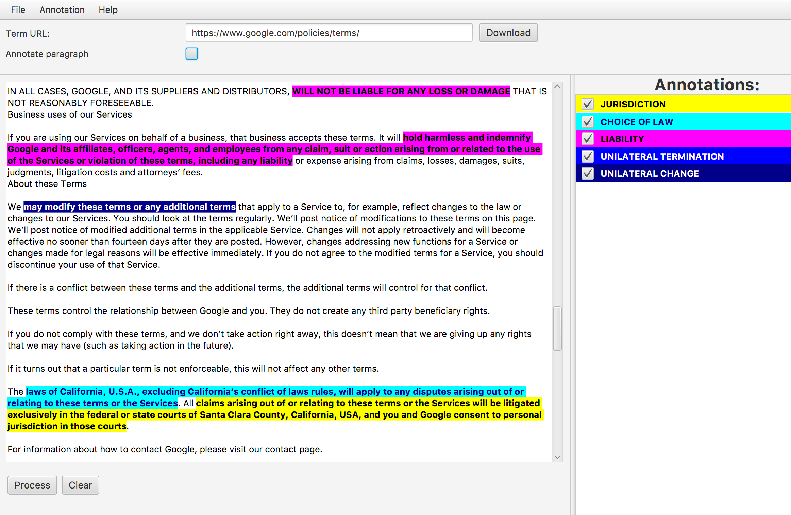
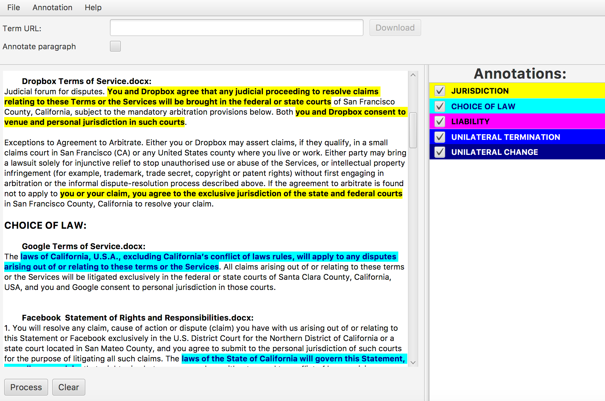
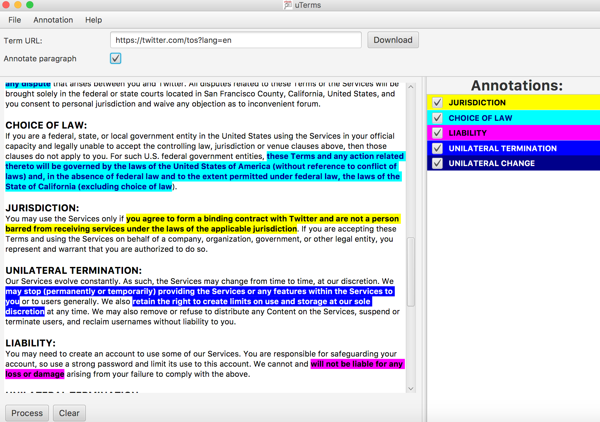

# Introduction

Welcome to the project page for **uTerms**: a _software to highlight potentially **u**nfair **Terms** of Service_. You can download it [here](#Downloads).

The idea behind **uTerms** is to assist consumer law organizations in ensuring that **terms of online services** are **fair**. We are all bound by these agreements ("I have read and accept..."), though we cannot influence their content. For such situations, European Union has put [unfair contract terms legislation](http://ec.europa.eu/consumers/consumer_rights/rights-contracts/unfair-contract/index_en.htm) in place. In theory, consumer law enforcers have competence to challenge businesses who use unbalanced contracts. In practice, there are so many platforms out there, and their contracts so long and so nontransparent, that consumer law organizations simply have not enough resources to check **all** of them. Hence, the idea to **automate** at least some tasks in their work. That's why we created **uTerms**.

## Contents
1. [Functionalities of uTerms](#functions)
2. [Download and installation of uTerms](#functions)
3. [The Team](#team)

# Functionalities of uTerms 

Figure 1

From the user’s perspective, the functionalities of the software are the following. Firstly, the programme imports a contract to be scanned – it can import it either from a file (like a pdf, or docx, or html), if the user has it saved on their computer, or directly from the internet. For the latter, it is sufficient for a user to copy/paste the URL from an internet browser into the software’s bar. A last option is to import the contract to the programme by directly copy/pasting the contents of the contract into the programme’s main window. Then, the user can click “Process” and, as an output, will receive the same document, with highlighted parts of the text, which are potentially unfair contractual clauses. The outcome of this process is presented in Figure 1, where we can see the terms produced as unfair for the case of Google's terms of service.
The highlighted (annotated) parts will be in different colours, each corresponding to a particular class of unfairness (as it stands now, based on the article by [Luzak and Loos](http://link.springer.com/article/10.1007/s10603-015-9303-7), we have 5 such categories: unilateral change, unilateral termination, liability, choice of law and jurisdiction). The colour coding is shown on the right column of Figure 1 under the title “Annotations”. The user might choose to display only a particular type of unfairness (e.g. only choice of law, or choice of law and liability, etc.), depending on the needs. In the example show above the software displays the entire contract. 

Figure 2

What is more, the software can display solely the annotated paragraphs (thereby sharply reducing the amount of the text displayed). This use mode is displayed in Figure 2. As we can see in both screenshots so far, these results are shown within the programme’s output window. If the user chooses to save the results, they might decide to save them as a pdf or docx document.

Figure 3

Additionally, we have created a functionality that allows comparing several documents at the same time, see Figure 3. In order to do this, the user can again choose a folder containing the chosen documents, or import them directly from the internet. The output will then contain potentially unfair clauses of all the analysed contracts, ordered by the type of unfairness, indicating which terms comes from terms of which service.

# Downloads 
  * Windows. Installation file ([.exe](https://github.com/ypanagis/uterms/releases/download/1.4.1/uTerms-1.4.1.exe))
  * MacOS. Zip file ([.zip](https://github.com/ypanagis/uterms/releases/download/1.4.1/uTerms.zip))
  
## Installation
### Windows
Download the `.exe` file from above. Run it and follow the steps. The software gets installed at: `C:\Users\<user_name>\AppData\Local\uTerms`.
### MacOSX
  1. Download the zip file from above
  2. Unzip it in a folder in your home directory
  
## Running the software
### Windows
On **Windows 10** your software will be under **Apps > uTerms.software > uTerms**, or you can press `Windows key + S` and type "uTerms" and Enter.

### MacOSX
**Note:** it is a good idea to install the **Java SE Development Kit** before you will be able to run the software. You can find it [here](http://www.oracle.com/technetwork/java/javase/downloads/jdk8-downloads-2133151.html). 
Trust the downloaded .dmg file, Oracle is sufficiently trustworthy!

To run the software for the first time execute the following steps:

  1. In a Mac open the folder that contains the software
  2. Hold the **Ctrl** button, click the file **uTerms.jar** and from the menu that opens select **Open**. The first time you run the software, Mac OS gives you a message that *this is an untrusted application*. 
  Ignore the message and click **Open**. 
  3. It will ask you for your username and password that you use to install applications. Enter both and hit Ok.
  4. From this moment you will be able to run your application by double clicking, or Ctrl+click and Open.
  
## Modifying the dictionary
_To be added soon._

# The Team 
This page accompanies a research paper, currently under a double-blind review. Since we link to it in the paper, we must leave the names of the authors out, until the review process is complete.
However, should you have any questions, comments, or would like to get in touch reagrding colaboration, let us know at: trzecikebab [at] gmail.com
